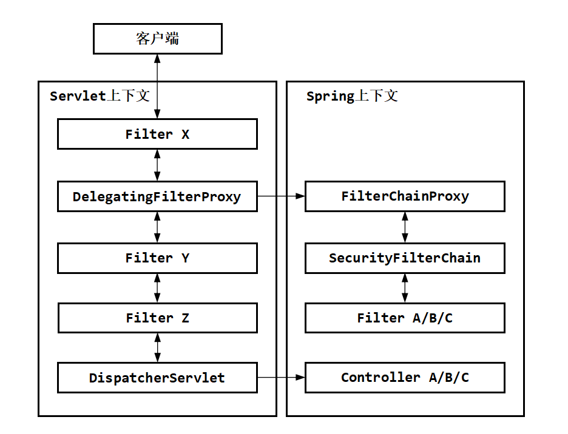

# 权限管理具体实现

## 设计思路

**需求**：某些操作需要权限，执行前分析用户的权限，然后鉴权。

**数据表**：user_info表

**实现逻辑**：

-   token内部存储用户id。
-   使用Filter分析token，获取用户id，然后通过获取数据库的用户权限，放入ThreadLocal中。
-   面对需要权限的接口，使用Interceptor拦截器过滤。

## 代码实现

----

#### 1 使用效果

下面是一个使用的例子：

```java
@Permission(role = UserRole.ADMIN)
@GetMapping(path = "operate")
public ResVo<String> operate(@RequestParam(name = "articleId") Long articleId, @RequestParam(name = "operateType") Integer operateType) {
    OperateArticleEnum operate = OperateArticleEnum.fromCode(operateType);
    if (operate == OperateArticleEnum.EMPTY) {
        return ResVo.fail(StatusEnum.ILLEGAL_ARGUMENTS_MIXED, operateType + "非法");
    }
    articleSettingService.operateArticle(articleId, operate);
    return ResVo.ok("ok");
}
```

其中@Permission就是所定义的注解：

```java
@Target({ElementType.METHOD, ElementType.TYPE})
@Retention(RetentionPolicy.RUNTIME)
@Documented
public @interface Permission {
    UserRole role() default UserRole.ALL;
}
```

```java
public enum UserRole {
    ADMIN,
    LOGIN,
    ALL;
}
```

----

#### 2 获取用户权限

在Filter中进行了信息的初始化：

```java
private HttpServletRequest initReqInfo(HttpServletRequest request, HttpServletResponse response) {
    if (isStaticURI(request)) return request;
    ...
    ReqInfoContext.ReqInfo reqInfo = new ReqInfoContext.ReqInfo();
    globalInitService.initLoginUser(reqInfo);// <==进入初始化@Aizen
    ReqInfoContext.addReqInfo(reqInfo);
    ...
    return request;
}
```

具体的初始化使用的globalInitService的initLoginUser()方法，源码如下：

```java
public void initLoginUser(ReqInfoContext.ReqInfo reqInfo) {
    HttpServletRequest request =
        ((ServletRequestAttributes) RequestContextHolder.currentRequestAttributes()).getRequest();
    if (request.getCookies() == null) return;
    
    Optional
        .ofNullable(SessionUtil.findCookieByName(request, LoginService.SESSION_KEY))// 尝试获取token
        .ifPresent(cookie -> initLoginUser(cookie.getValue(), reqInfo));// 假如有则初始化
}

public void initLoginUser(String session, ReqInfoContext.ReqInfo reqInfo) {
    BaseUserInfoDTO user = userService.getAndUpdateUserIpInfoBySessionId(session, null);// <==进入操作阶段
    reqInfo.setSession(session);
    if (user != null) {
        reqInfo.setUserId(user.getUserId());
        reqInfo.setUser(user);
        reqInfo.setMsgNum(notifyService.queryUserNotifyMsgCount(user.getUserId()));
    }
}
```

在userService.getAndUpdateUserIpInfoBySessionId()方法中，实现如下：

```java
public BaseUserInfoDTO getAndUpdateUserIpInfoBySessionId(String session, String clientIp) {
    if (StringUtils.isBlank(session)) return null;

    Long userId = userSessionHelper.getUserIdBySession(session);// 分析token
    if (userId == null) return null;
    ...
    UserInfoDO user = userDao.getByUserId(userId);// 通过数据库获取用户信息
    ...
    return user;
}
```

分析token使用的UserSessionHelper的getUserIdBySession()方法如下：

```java
public Long getUserIdBySession(String session) {
    // jwt的校验方式，如果token非法或者过期，则直接验签失败
    try {
        DecodedJWT decodedJWT = verifier.verify(session);
        String pay = new String(Base64Utils.decodeFromString(decodedJWT.getPayload()));
        // jwt验证通过，获取对应的userId
        String userId = String.valueOf(JsonUtil.toObj(pay, HashMap.class).get("u"));

        return Long.valueOf(user);
    } catch (Exception e) {
        log.info("jwt token校验失败! token: {}, msg: {}", session, e.getMessage());
        return null;
    }
}
```

由此，在UserInfoContext中，初始化了UserInfo，但是假如没有该用户，则此时UserInfo内部信息是空的。

总结如下：

1.  在filter层中先判断Cookie中是否存在token，有则获取。否则上下文中有关用户信息就是空的。
2.  获得token，调用UserSessionHelper的getUserIdBySession()方法将token进行解析，获得payload部分中存储的userId。
3.  如果获得userId没有失效，就通过userId在数据库中获得用户信息，并存入上下文中。

**补充信息**：这里的UserSessionHelper其实就是token的管理，在我看来很别扭，是因为在技术派中，是将token存入Cookie，其中Cookie是存储在用户本地的信息，会随着请求发送，前端不需要做额外操作；但是在一般情况下，token会放入请求头的Authoration部分，由前端请求时设置，而不是默认发送。（技术派的文档里面也提到这一点，好像是因为这个是前后端一体的缘故）

**吐槽一下**：

- 当用户token校验失败时，技术派一路上返回的null，这样写会导致后期的维护困难。下面两个方法：
    - 抛出异常。

    - 当用户未登录时，也应该赋给用户一个未登录的状态例如“UnLoged/Unverified”。

- 我个人建议，在token中放入用户的权限。像技术派这样每次都使用数据库已经偏离了token无状态的优势了。


----

#### 3 权限过滤

具体使用的是HandlerInterceptor接口实现权限过滤，具体实现如下：

```java
@Override
public boolean preHandle(HttpServletRequest request, HttpServletResponse response, Object handler)
    throws Exception {
    if (handler instanceof HandlerMethod) {
        // 1. 得到接口需要的权限信息
        HandlerMethod handlerMethod = (HandlerMethod) handler;
        Permission permission = handlerMethod.getMethod().getAnnotation(Permission.class);
        if (permission == null) {// 兼容类的权限设置
            permission = handlerMethod.getBeanType().getAnnotation(Permission.class);
        }

        // 2. 当访问“不需要权限的接口”时
        if (permission == null || permission.role() == UserRole.ALL) {
            // 对有身份的用户执行活跃度增加
            if (ReqInfoContext.getReqInfo() != null) {
                SpringUtil.getBean(UserActivityRankService.class).
                    addActivityScore(
                    	ReqInfoContext.getReqInfo().getUserId(),
                    	new ActivityScoreBo().setPath(ReqInfoContext.getReqInfo().getPath()));
            }
            return true;
        }
        
        // 3. 当访问“需要权限的接口”时
        // 3.1 对游客执行以下操作
        if (ReqInfoContext.getReqInfo() == null || ReqInfoContext.getReqInfo().getUserId() == null) {
            if (handlerMethod.getMethod().getAnnotation(ResponseBody.class) != null ||
                // 3.1.1 访问需要登录的rest接口，直接返回错误信息
                handlerMethod.getMethod().getDeclaringClass().getAnnotation(RestController.class) != null) {
                response.setContentType(MediaType.APPLICATION_JSON_UTF8_VALUE);
                response.getWriter().println(JsonUtil.toStr(ResVo.fail(StatusEnum.FORBID_NOTLOGIN)));
                response.getWriter().flush();
                return false;
            } else if (request.getRequestURI().startsWith("/api/admin/") ||
                       request.getRequestURI().startsWith("/admin/")) {
                // 3.1.2 访问的是admin接口
                response.sendRedirect("/admin");
            } else {
                // 3.1.3 访问需要登录的页面时，直接跳转到登录界面
                response.sendRedirect("/");
            }
            return false;
        }
        // 3.2 对不是管理员的用户执行以下操作
        if (permission.role() == UserRole.ADMIN &&
            !UserRole.ADMIN.name().equalsIgnoreCase(ReqInfoContext.getReqInfo().getUser().getRole())) {
            // 设置为无权限
            response.setStatus(HttpStatus.FORBIDDEN.value());
            return false;
        }
    }
    return true;
}
```

**补充信息**：

-   只有当Interceptor的preHandle()方法（即上面的方法）返回true时，后续的handler才会继续执行；否则返回当前的Response。
-   技术派实现的AsyncHandlerInterceptor接口，相比较一般的HandlerInterceptor接口，能够拦截异步操作。

**吐槽一下**：

-   使用Interceptor的拦截固然很好，但是整体的框架设计存在问题。不建议将权限的过滤和其他业务逻辑参杂在一起，这样方法会导致后期的维护困难。简易分离权限和其他业务，或者使用更加有效的权限框架来处理。

-   批评一下，这里的代码有点乱，注释有点看不懂，我花时间整理了一下才明白。下面这样写可能会好很多：

    ```java
    UserRole userRole = ...;
    UserRole needRole = ...;
    return switch (needRole) {
        case ALL -> doAll(userRole, reponse);
        case USER -> doUser(userRole, reponse);
        case ADMIN -> doAdmin(userRole, reponse);
        default throw new UnreachableException("...");
    };
    ```

    ```java
    private Permission analysePermission(...) {...}
    private boolean doAll(...) {...}
    private boolean doUser(...) {...}
    private boolean doAdmin(...) {...}
    ```


----

#### 4 Spring Security的设计

感觉整体的设计很模糊，这里提一下Spring Security的设计。

下面是Spring Security的设计图：



-   **用户安全信息管理**：关于安全的内容由SecurityContextHolder类来保存，内部由ThreadLocal实现，包括用户的角色、权限、账号和密码等。

-   **安全检验入口**：由一个Filter（Servlet的Filter类，为图片中的DelegatingFilterProxy）执行信息处理，这是一个执行链的入口，用于开启执行一系列的链式安全检验。进入某个SecurityFilter后，如果不满足具体的执行前提，会交给下一个SecurityFilter进行处理。

-   **安全检验逻辑**：

    -   对于安全检验的SecurityFilter，会检查SecurityContextHolder中是否存在用户信息，存在则表示已经通过安全校验，否则会执行相关的安全检验，例如账号密码登录、通过token登录等。当通过安全检验时，会将具体的安全信息放入SecurityContextHolder中。

    -   当某个SecurityFilter发现权限不通过，例如密码错误时，会抛出对应异常。这个异常由“执行链靠前的异常捕获Filter”捕获，并调用相关的类执行处理。大概代码逻辑如下：

        ```java
        try {
            next.dofilter(...);
        } catch (WrongPasswordException e) {
            wrongPasswordHandler.handle(e);
        } catch (...) {
            ...
        }
        ```

在Spring Securiy框架中，没有提供关于token操作的SecurityFilter，需要用户自定义。

当调用需要权限的方法时，Spring Security提供了对应的注解，本质上会使用由Spring AOP实现的具体的权限分析和管理（不确定，也可能是Interceptor），会抛出对应异常。关于Spring Security的详细使用内容可以看我在知识星球发过的[文档](https://wx.zsxq.com/dweb2/index/topic_detail/211242288522241)。
